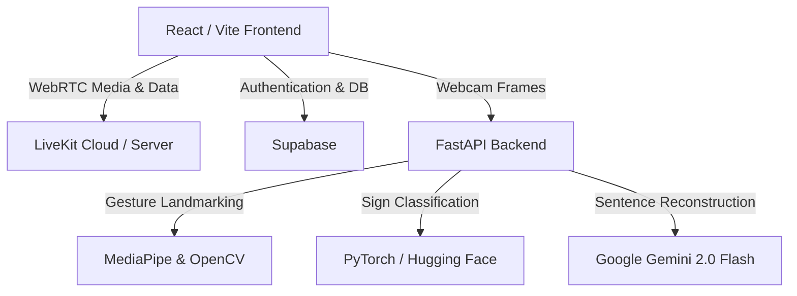

# Samvad (संवाद) — Real-Time Sign Language Translation & Learning Platform

Samvad is an AI-powered, culturally-inspired communication platform designed to bridge the gap between the hearing-impaired community and the rest of society. Combining state-of-the-art computer vision, deep learning, generative AI, and WebRTC technology, Samvad enables real-time sign language translation in video calls, interactive 3D learning modules, and a customizable gesture dictionary.

The application is styled with a premium, Indian-rooted **"Mudra" parchment design philosophy**, offering a visually stunning, responsive, and highly interactive user experience.

---

## 📞 Video Calling Solution Details

In response to your query regarding the video calling integration:

*   **Video Calling Framework:** **LiveKit** (an open-source, WebRTC-based platform designed for low-latency real-time video, audio, and data stream transmission).
*   **Frontend Client SDK:** `livekit-client` version `^2.19.0` (handles room connections, media tracks, and reliable WebRTC data channels).
*   **React Components Library:** `@livekit/components-react` version `^2.9.21` (pre-built components integrated into the call interface).
*   **Backend Token Generation:** `livekit` (Python SDK) is used in the FastAPI service to generate secure, signed JSON Web Tokens (JWT) for call room entry.

---

## 🌟 Key Features

### 1. 📞 Module: Real-Time Sign Translation Video Call
*   **Peer-to-Peer Calls:** Connect two users in high-quality, WebRTC-powered video chats using **LiveKit**.
*   **Sign-to-Text Subtitles:** While speaking or gesturing, in-browser MediaPipe and our backend translation model recognize sign language and overlay subtitles in English or Hindi.
*   **Text-to-Speech (TTS):** Incoming translated subtitles can be spoken aloud in the recipient's chosen language (English or Hindi) using web accessibility voice engines.
*   **Network Resilience & Safety:** Features reconnection banners, a camera liveness watchdog, privacy slider detection (black frame warnings), and room capacity guards (capped at 2 users).
*   **Custom Gestures:** Train custom gestures locally using a KNN classifier and save them to your account.

### 2. 📖 Module: Sign Language Learning Hub
*   **Text-to-Sign 3D Interpreter:** Input words or sentences and watch them translated into Indian Sign Language (ISL) using animated **Three.js** 3D characters (**XBot** and **YBot**).
*   **Interactive Quiz System:** Test your knowledge of sign language with real-time feedback.
*   **Interactive Flashcards:** Memorize gestures using animated cards.
*   **ISL Video Library & Dictionary:** Browse dictionary words or search video databases to learn new signs.

### 3. 🔮 Module: Standalone Real-Time Translation
*   Use your webcam to translate sign language directly into clean text.
*   Uses a hybrid system: local Hugging Face deep learning models classify hand gestures, and Google Gemini API (Gemini 2.0 Flash) processes sign sequences to construct fluid, grammatically correct sentences.

---

## 🛠️ Architecture & Tech Stack



### Frontend
*   **Core:** React (`^18.2.0`) & Vite (`^5.1.0`)
*   **Styling:** Tailwind CSS (`^3.4.0`)
*   **Animations:** Framer Motion (`^12.40.0`)
*   **Graphics:** Three.js (`^0.136.0`) for 3D avatars
*   **State Management:** Zustand (`^5.0.13`)
*   **Icons:** Lucide React (`^0.263.1`)

### Backend & Machine Learning
*   **API Framework:** FastAPI (`>=0.111.0`) & Uvicorn ASGI server
*   **Landmark Tracking:** MediaPipe (`0.10.33`) & OpenCV (`4.9.0.80`)
*   **Deep Learning Models:** PyTorch (`>=2.0.0`) with weights retrieved via `huggingface_hub`
*   **Generative AI:** Google Generative AI (`>=0.7.0`) for the **Gemini 2.0 Flash** translation chain

### Database & Auth
*   **Database:** Supabase (`supabase-js ^2.39.0`) for User Auth, Learning Progression, Quiz Scores, and Custom Sign Dictionary data.

---

## 🚀 Getting Started (Local Setup)

To set up the project locally on your machine, follow these steps.

### Prerequisites
*   Node.js (v18 or higher)
*   Python (3.9 to 3.11 recommended)
*   Git

---

### Step 1: Clone the Repository
```bash
git clone https://github.com/your-username/samvad.git
cd samvad
```

### Step 2: Frontend Installation & Setup
1. Install package dependencies:
    ```bash
    npm install
    ```
2. Create a `.env` file in the root directory:
    ```env
    VITE_SUPABASE_URL=https://your-supabase-url.supabase.co
    VITE_SUPABASE_ANON_KEY=your-supabase-anon-key
    VITE_GOOGLE_API_KEY=your-google-cloud-api-key
    VITE_TRANSLATION_API=http://localhost:5002
    VITE_LIVEKIT_URL=wss://your-livekit-project.livekit.cloud
    ```
3. Start the Vite development server:
    ```bash
    npm run dev
    ```

---

### Step 3: Backend Translation Service Setup
1. Navigate to the translation service directory:
    ```bash
    cd services/translation-service
    ```
2. Create and activate a Python virtual environment:
    ```bash
    # On Windows:
    python -m venv .venv
    .venv\Scripts\activate

    # On macOS/Linux:
    python -m venv .venv
    source .venv/bin/activate
    ```
3. Install dependencies:
    ```bash
    pip install -r requirements.txt
    ```
4. Create a `.env` file inside `services/translation-service/`:
    ```env
    GEMINI_API_KEY=your-gemini-api-key
    SUPABASE_URL=https://your-supabase-url.supabase.co
    SUPABASE_ANON_KEY=your-supabase-anon-key
    LIVEKIT_API_KEY=your-livekit-api-key
    LIVEKIT_API_SECRET=your-livekit-api-secret
    ```
5. Start the FastAPI development server:
    ```bash
    uvicorn app.main:app --host 0.0.0.0 --port 5002 --reload
    ```

---

## 📄 License

This project is licensed under the MIT License. See the [LICENSE](LICENSE) file for details.
